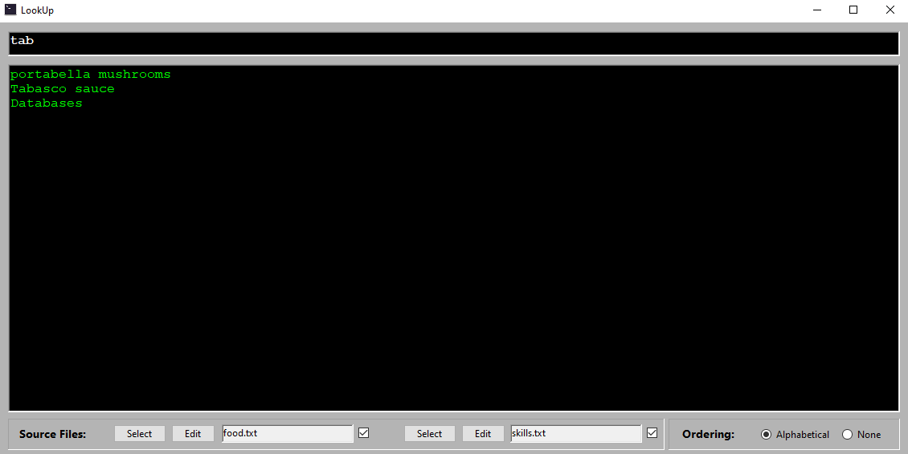
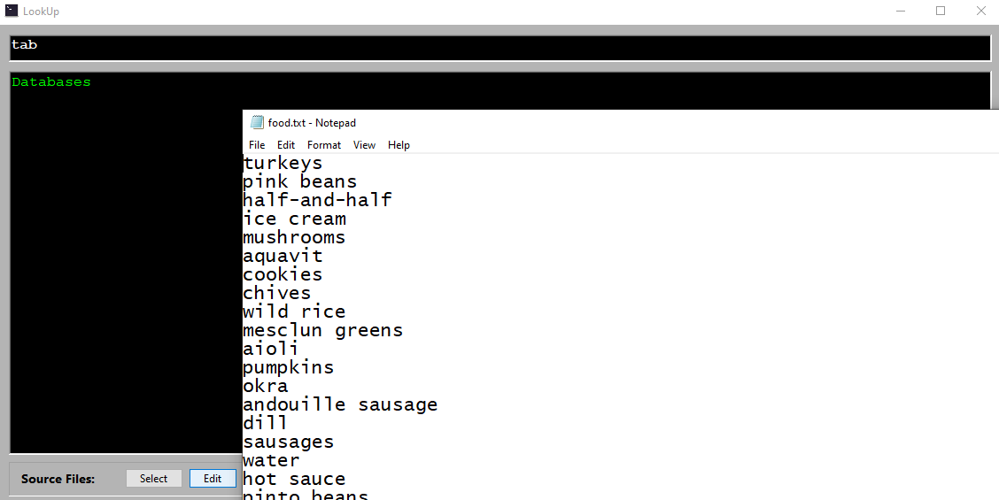
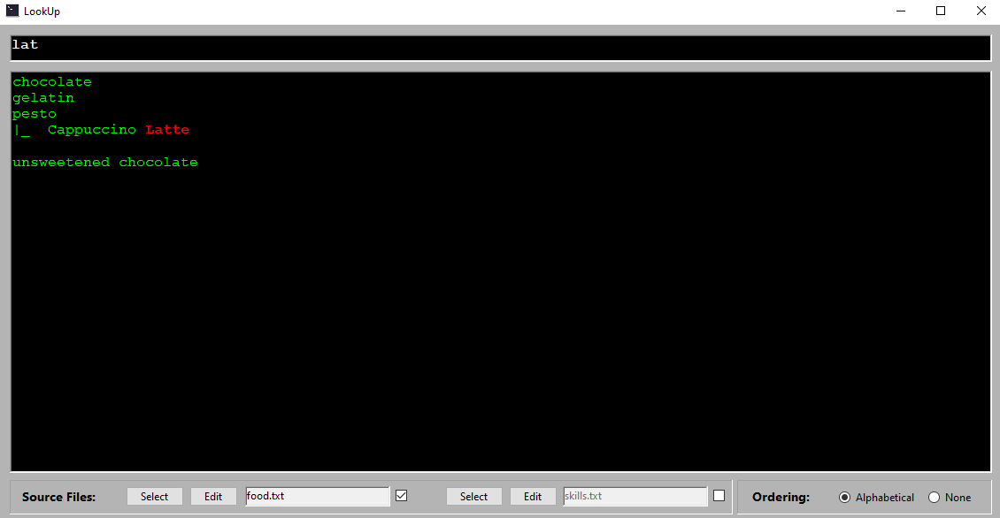

# Lookup

---

**Lookup** è un programma leggero progettato per consentire la ricerca di contenuti all'interno di uno o due file di testo. Creato per soddisfare un'esigenza personale di mio papà (Luca), il nome del programma deriva dal suo nome e dal termine inglese "to look up" (cercare), che descrive perfettamente la funzione principale del software: aiutare a trovare rapidamente ciò di cui si ha bisogno.

Questo strumento è ideale per chi desidera archiviare e recuperare informazioni velocemente, come libri letti, file di lavoro, email o contatti telefonici.

---

## Funzionalità

- **Selezione di file**: Puoi caricare fino a 2 file di testo per cercare al loro interno.
- **Barra di ricerca dinamica**: La ricerca si aggiorna automaticamente mentre digiti, filtrando i risultati in tempo reale.
- **Visualizzazione dei risultati**: I risultati sono mostrati con le righe che contengono la stringa cercata.
- **Ordinamento dei risultati**: Puoi scegliere tra due modalità di ordinamento:
  - **Ordine alfabetico**
  - **Ordine nativo del file**
- **Modifica rapida**: Una scorciatoia ti permette di aprire rapidamente il file per modificarlo.
- **Righe aggregate**: Puoi definire righe aggregate per visualizzare una sorta di gerarchia: ponendo alla fine di una riga il carattere '\\', la riga successiva nel file sarà collegata alla precedente e l'aggregato sarà a tutti gli effetti considerato come una riga sola (se una delle righe dell'aggregato ha una corrispondenza con il token di ricerca, nel risultato compariranno tutte).
- **Evidenziazione personalizzata**: Alcuni campi possono essere evidenziati in rosso per facilitarne l'individuazione racchiudendoli tra '%' (Ad esempio Hello %World% farà sì che il termine "World" risulti evidenziato.

---

## Screenshot

  
  
  

---

## Contribuire

Se vuoi contribuire a questo progetto, fai un fork del repository, crea un ramo per la tua feature o correzione e invia una pull request. Assicurati di seguire lo stile di codifica e includere test quando possibile.

---

## Licenza

Questo progetto è sotto licenza **Creative Commons**. Vedi il file `LICENSE` per maggiori dettagli.
